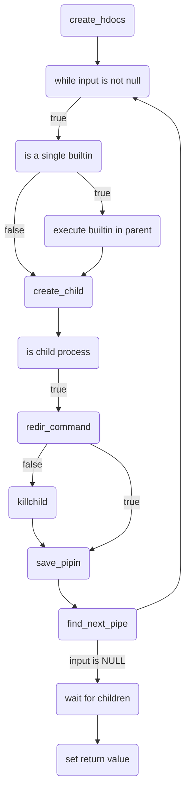

# Minishell

Minishell is a project of the 42 Common Core. It aims to create a basic version of a Bash, capable of executing commands, handling redirections and signals, and implementing common built-in commands.

## Features
- Single and double quotes interpretation and removal
- Input tokenisation
- Variable substitution
- Executing Bash binaries and builtins (cd, echo, pwd, export, unset, exit, env), alone or in pipelines with absolute and relative paths
- Recreation of said builtin commands,  
- Redirections handling (<, >, <<, >>)
- Handling of $? operator to display pipelines return values
- Custom signal handling (SIGINT, SIQUIT, SIGPIPE)
## Technologies Used
- Language: C
- Valgrind
- Library: readline


## Installation

```bash
git clone https://github.com/Jauppp/minishell.git minishell
cd minishell
make

```
To run Minishell with Valgrind (with Readline && Bash supression):
```bash
make run
```

## References

- [Bash Reference Manual](https://www.gnu.org/savannah-checkouts/gnu/bash/manual/bash.html)
- [Understanding Shell Expansion](https://effective-shell.com/part-6-advanced-techniques/understanding-shell-expansion/)
- [Readline Documentation](https://www.man7.org/linux/man-pages/man3/readline.3.html)


## Authors

- [@csweetin](https://github.com/cha202)
- [@cdomet-d](https://github.com/Jauppp)


## Appendix

## Execution loop logic graph


