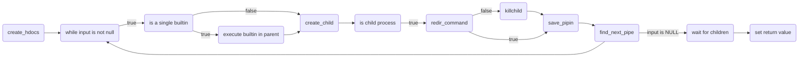
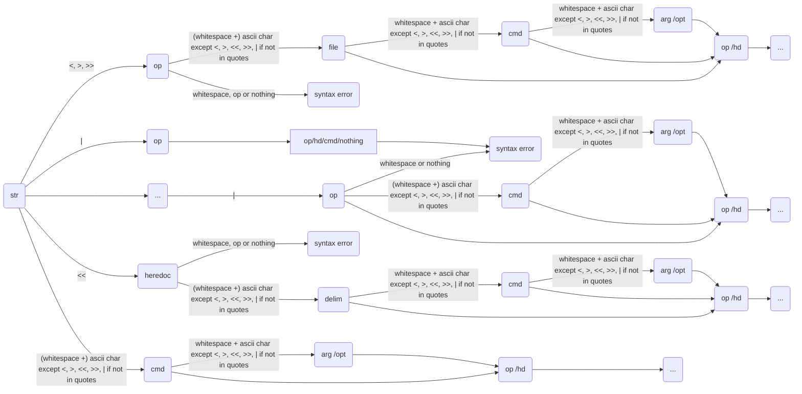

# Minishell

Minishell is a project of the 42 Common Core. It aims to create a basic version of a Bash, capable of executing commands, handling redirections and signals, and implementing common built-in commands.

## Features
- Single and double quotes interpretation and removal
- Input tokenisation
- Variable substitution
- Executing Bash binaries and builtins (cd, echo, pwd, export, unset, exit, env), alone or in pipelines with absolute and relative paths
- Recreation of said builtin commands,  
- Redirections handling (<, >, <<, >>)
- Handling of $? operator to display pipelines return values
- Custom signal handling (SIGINT, SIQUIT, SIGPIPE)
## Technologies Used
- Language: C
- Valgrind
- Library: readline


## Installation

```bash
git clone https://github.com/Jauppp/minishell.git minishell
cd minishell
make

```
To run Minishell with Valgrind (with Readline && Bash supression):
```bash
make run
```

## References

- [Bash Reference Manual](https://www.gnu.org/savannah-checkouts/gnu/bash/manual/bash.html)
- [Understanding Shell Expansion](https://effective-shell.com/part-6-advanced-techniques/understanding-shell-expansion/)
- [Readline Documentation](https://www.man7.org/linux/man-pages/man3/readline.3.html)


## Authors

- [@csweetin](https://github.com/cha202)
- [@cdomet-d](https://github.com/Jauppp)


# Appendix

## Execution loop logic graph





## File tree
```
Makefile
README.md
includes/
├── exec.h
├── libft
├── minishell.h
└── parsing.h
utils/
├── exec.md
└── supp.supp
scripts	/
├── exf
├── extract_funct
├── prep
└── push	
src/
├── main.c
├── builtins/
│   ├── bt_functs/
│   │   ├── builtin_utils.c	
│   │   ├── echo.c
│   │   ├── cd.c 
│   │   ├── cd_canon_form.c	
│   │   ├── cd_utils.c
│   │   ├── env.c	
│   │   ├── exit.c
│   │   ├── export.c	
│   │   ├── export_utils.c
│   │   ├── pwd.c	
│   │   └── unset.c
│   ├── exec_builtins.c
│   └── exec_builtins_utils.c
├── exec/
│   ├── utils/
│   │   ├── arenvlst.c	
│   │   ├── fd_handling.c	
│   │   ├── exec_utils.c	
│   │   ├── operators_utils.c
│   │   └── redirection_utils.c
│   ├── exec.c	
│   ├── exec_errors.c	
│   └── redirections.c
├── heredoc/
│   ├── heredoc.c	
│   ├── heredoc_errors.c
│   ├── heredoc_expand.c	
│   └── heredoc_utils.c
├── lst_utils/
│   ├── env_lst_utils.c
│   └── input_lst_utils.c
├── parsing/
│   ├── expansion/
│   │   ├── expand.c	
│   │   ├── expand_split.c
│   │   ├── expand_split_utils.c	
│   │   └── expand_utils.c
│   ├── tokenization/
│   │   ├── cmd_opt.c	
│   │   ├── create_data.c
│   │   ├── tokenization.c	
│   │   ├── tokenization_utils.c	
│   │   └── toke_type.c
│   ├── cmd_path.c	
│   ├── cmd_path_utils.c
│   ├── create_lst.c	
│   ├── parsing.c
│   ├── rm_quotes.c	
│   └── toke_builtin.c
├── signals/
│   ├── sighandler.c
│   └── sig_set_stat.c
└── utils/
    └── error_handling.c
```
