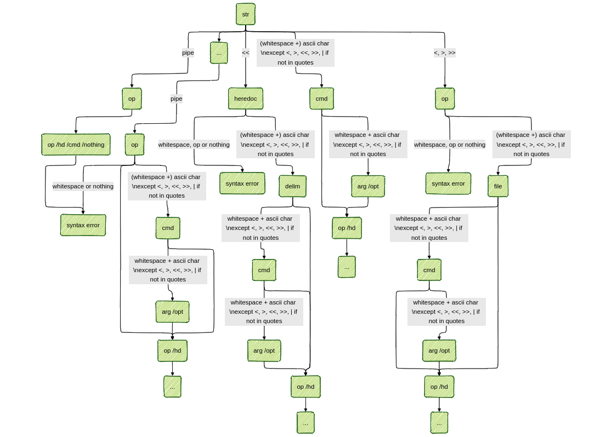

<p align="center">
  
</p>
<p align="center">
<h1 align="center"></h1>
</p>
<p align="center">
<em>Minishell is a project of the 42 Common Core. It aims to create a basic version of a Bash, capable of executing commands, handling redirections and signals, and implementing common built-in commands.</em>
</p>
<p align="center">
	
	
	
<p>
<p align="center">
	<!-- default option, no dependency badges. -->
</p>

<br><!-- TABLE OF CONTENTS -->
<details>
  <summary>Table of Contents</summary><br>

- [Features](#features)
- [Repository Structure](#repository-structure)
- [Modules](#modules)
- [Getting Started](#getting-started)
	- [Installation](#installation)
- [Authors](#authors)
- [Appendix](#appendix)
	- [Execution](#execution)
	- [Parsing tokeniser diagram](#parsing-tokeniser-diagram)
- [Acknowledgments](#acknowledgments)
</details>
<hr>

##  Features

|   | Feature   | Description  |
|----|------------------------------|--------------------------------------------------------------------------------------------------------------------------|
| ⚙️  | Architecture| Custom implementation of a Unix-like shell, utilizing C programming language. Efficient resource management through optimization libraries. |
| 🔩 | Code Quality | Well-structured and clean code, following best practices for modularity, readability, and maintainability. |
| 🔌 | Integrations | Built using POSIX-compliant functions to integrate with various Unix-like systems. Dependencies include 'h' and custom makefile rules.   |
| 🧩 | Modularity| The codebase is divided into logical modules (utilities, main executable, heredoc handling) for efficient development and reusability.  |
| 📦 | Dependencies | Project depends on the Readline library.|

---

##  Repository Structure

```sh
Makefile
README.md
includes/
├── exec.h
├── libft
├── minishell.h
└── parsing.h
utils/
├── exec.md
└── supp.supp
scripts	/
├── exf
├── extract_funct
├── prep
└── push	
src/
├── main.c
├── builtins/
│   ├── bt_functs/
│   │   ├── builtin_utils.c	
│   │   ├── echo.c
│   │   ├── cd.c 
│   │   ├── cd_canon_form.c	
│   │   ├── cd_utils.c
│   │   ├── env.c	
│   │   ├── exit.c
│   │   ├── export.c	
│   │   ├── export_utils.c
│   │   ├── pwd.c	
│   │   └── unset.c
│   ├── exec_builtins.c
│   └── exec_builtins_utils.c
├── exec/
│   ├── utils/
│   │   ├── arenvlst.c	
│   │   ├── fd_handling.c	
│   │   ├── exec_utils.c	
│   │   ├── operators_utils.c
│   │   └── redirection_utils.c
│   ├── exec.c	
│   ├── exec_errors.c	
│   └── redirections.c
├── heredoc/
│   ├── heredoc.c	
│   ├── heredoc_errors.c
│   ├── heredoc_expand.c	
│   └── heredoc_utils.c
├── lst_utils/
│   ├── env_lst_utils.c
│   └── input_lst_utils.c
├── parsing/
│   ├── expansion/
│   │   ├── expand.c	
│   │   ├── expand_split.c
│   │   ├── expand_split_utils.c	
│   │   └── expand_utils.c
│   ├── tokenization/
│   │   ├── cmd_opt.c	
│   │   ├── create_data.c
│   │   ├── tokenization.c	
│   │   ├── tokenization_utils.c	
│   │   └── toke_type.c
│   ├── cmd_path.c	
│   ├── cmd_path_utils.c
│   ├── create_lst.c	
│   ├── parsing.c
│   ├── rm_quotes.c	
│   └── toke_builtin.c
├── signals/
│   ├── sighandler.c
│   └── sig_set_stat.c
└── utils/
    └── error_handling.c
```

---

##  Modules

<details closed><summary>.</summary>

| File   | Summary |
| ---| --- |
| [Makefile](https://github.com/Jauppp/minishell/blob/master/Makefile) | This makefile includes rules for creating, cleaning, and recompiling the main executable and the bonus file. It uses ANSI escape codes to colorize and format its output, providing better readability and aesthetics. |

</details>

<details closed><summary>utils</summary>

| File| Summary|
| --- | ---|
| [supp.supp](https://github.com/Jauppp/minishell/blob/master/utils/supp.supp) | Optimizes memory usage by ignoring libreadline leaks and bash script leaks from various usr/bin objects, ensuring efficient resource management within the minishell projects architecture. |

</details>

<details closed><summary>src</summary>

| File   | Summary |
| ---| --- |
| [main.c](https://github.com/Jauppp/minishell/blob/master/src/main.c) | Launches a custom Minishell environment. Initializes environment variables and signal listeners. Reads input commands line-by-line and executes them as builtins or external commands via execve(). Handles history and error management, ensuring a smooth interactive shell experience. Key functions include parsing, history management, and exit handling. |

</details>

<details closed><summary>src.heredoc</summary>

| File| Summary |
| --- | ---|
| [heredoc_utils.c](https://github.com/Jauppp/minishell/blob/master/src/heredoc/heredoc_utils.c)   | This code module within the MiniShell repository handles the functionality of heredoc (delimited text). It handles the detection and traversal of heredoc instances, extracting delimiters, and monitoring line input against those delimiters for proper handling. These functionalities enable seamless execution of user-defined commands within heredoc syntax.   |
| [heredoc.c](https://github.com/Jauppp/minishell/blob/master/src/heredoc/heredoc.c)   | Implemented heredoc functionality within Minishell. This C file facilitates handling user input during heredoc commands. When prompted with MiniHere$, the script reads and executes lines until an exit command or EOF is encountered. It writes these lines to a temporary file in /tmp directory. Once done, the script closes the file and continues executing subsequent shell instructions. |
| [heredoc_expand.c](https://github.com/Jauppp/minishell/blob/master/src/heredoc/heredoc_expand.c) | Expands heredoc inputs based on environment variables. The file `heredoc_expand.c` in the `src/heredoc` directory performs replacement of $ symbols with corresponding environment variable values for heredoc input processing, ensuring correct evaluation and interpretation in the Minishell architecture.   |
| [heredoc_errors.c](https://github.com/Jauppp/minishell/blob/master/src/heredoc/heredoc_errors.c) |This file handles errors encountered during a heredoc tmp file creation, exiting cleanly.|

</details>

<details closed><summary>src.builtins</summary>

| File| Summary   |
| --- | ---|
| [exec_builtins_utils.c](https://github.com/Jauppp/minishell/blob/master/src/builtins/exec_builtins_utils.c) |This file countains the function allowing to check whether current pipeline countains a built-in function, as its execution is different from a regular command.|
| [exec_builtins.c](https://github.com/Jauppp/minishell/blob/master/src/builtins/exec_builtins.c) | Handles single builtin executions, ie. execution of a built-in outside a pipeline ; it operates redirections if need be and executes the built-in in the main process. |

</details>

<details closed><summary>src.builtins.bt_functs</summary>

| File  | Summary  |
| ---   | ---  |
| [export.c](https://github.com/Jauppp/minishell/blob/master/src/builtins/bt_functs/export.c)   | Export.c`, a module within the Minishell builtin functions. Main Purpose: parses the input and export the new variables in Minishell's environment. |
| [export_utils.c](https://github.com/Jauppp/minishell/blob/master/src/builtins/bt_functs/export_utils.c)   | The `export_utils.c` file focuses on managing the shells environment variables. This includes sorting and displaying them in an organized fashion when invoked by the `export` built-in command. Specifically, the functions here ensure that exported variables appear in a sorted and easily readable manner for the user, enhancing overall usability of the Minishell. |
| [pwd.c](https://github.com/Jauppp/minishell/blob/master/src/builtins/bt_functs/pwd.c)  | Function within Minishells builtins, providing the user with their current working directory. The pwd()' function checks if the variable PWD is defined within the environment. If not, it retrieves and outputs the current working directory using getcwd(). Error handling is included to address issues such as SIGPIPE signals or file system errors during execution.  |
| [unset.c](https://github.com/Jauppp/minishell/blob/master/src/builtins/bt_functs/unset.c) | This `src/builtins/bt_functs/unset.c` file provides functionality for removing variables from the Minishell environment. It uses comparison and linked-list manipulation to locate specific environment keys, which are then removed and reconnected in the list. The `unset()` function takes a linked-list structure containing the current shells environment, processes user input, and removes any specified key-value pairs accordingly, effectively updating the shells internal variables.   |
| [cd_utils.c](https://github.com/Jauppp/minishell/blob/master/src/builtins/bt_functs/cd_utils.c)   | This `src/builtins/bt_functs/cd_utils.c` file controls the handling and updating of the current working and old directories (`PWD` and `OLDPWD`) for Minishell. It ensures valid directories are used, prevents name too long errors, and manages the environment variables accordingly when directory changes occur.  |
| [cd.c](https://github.com/Jauppp/minishell/blob/master/src/builtins/bt_functs/cd.c)| Implemented in src/builtins/bt_functs/cd.c. This C code function updates the working directory of the minishell, enabling users to switch between directories and access files within the file system using intuitive commands such as cd /path or cd-for moving back and forth between visited directories. The implementation covers special cases like switching to home directory or the last-visited one with a single character dash-.   |
| [cd_canon_form.c](https://github.com/Jauppp/minishell/blob/master/src/builtins/bt_functs/cd_canon_form.c) | The function `prep_path()` in the `src/builtins/bt_functs/cd_canon_form.c` file adjusts a given directory path, converting it into its canonical form (absolute and without dots). It helps in maintaining the consistency and functionality of the cd builtin command within the Minishell environment by handling scenarios such as moving to parent directories (..).|
| [env.c](https://github.com/Jauppp/minishell/blob/master/src/builtins/bt_functs/env.c)  | The src/builtins/bt_functs/env.c file is a utility within the MiniShell project that lists all defined environment variables. It gracefully handles cases where the list exceeds a certain limit and ensures each variable is printed on stdout, providing developers with quick access to essential configuration settings."  |
| [echo.c](https://github.com/Jauppp/minishell/blob/master/src/builtins/bt_functs/echo.c)| The `echo.c` file within the Minishell repository is responsible for implementing the built-in echo command. This function accepts an array of strings and prints them to the standard output stream. It supports handling options such as-n which prevents the addition of a trailing newline character at the end.|
| [builtin_utils.c](https://github.com/Jauppp/minishell/blob/master/src/builtins/bt_functs/builtin_utils.c) | The `src/builtins/bt_functs/builtin_utils.c` file houses key functions for manipulating environment variables within the Minishell environment. It includes a function to split a string using a delimiter, find an existing variable within the list of environment variables, and dynamically add new ones. |
| [exit.c](https://github.com/Jauppp/minishell/blob/master/src/builtins/bt_functs/exit.c)| This `exit.c` file within the `src/builtins/bt_functs` folder modifies the current process status when a user-specified integer value is provided as an argument to the exit builtin command, allowing a controlled termination of the Minishell execution with custom return statuses. |

</details>

<details closed><summary>src.utils</summary>

| File  | Summary |
| ---   | --- |
| [error_handling.c](https://github.com/Jauppp/minishell/blob/master/src/utils/error_handling.c) | This code file in the `src/utils/error_handling.c` within the Minishell project handles various error scenarios in the shell. Functions such as `exit_no_input()`, `fatal_exit()`, and custom error-reporting functions like `errjoin()`, `print_error()`, and `verror()` ensure graceful handling of user input errors, readline errors, or unexpected issues within the system calls. This facilitates a more stable and resilient shell experience for users by providing clear, concise error messages. |

</details>

<details closed><summary>src.lst_utils</summary>

| File| Summary |
| --- | --- |
| [input_lst_utils.c](https://github.com/Jauppp/minishell/blob/master/src/lst_utils/input_lst_utils.c) | Manages dynamic memory for a linked list of input data structures within the MiniShell project, facilitating efficient management of user-entered commands and associated environment variables. This includes adding new nodes, freeing existing ones when  no longer needed, and maintaining their order through proper linkage mechanisms. |
| [env_lst_utils.c](https://github.com/Jauppp/minishell/blob/master/src/lst_utils/env_lst_utils.c) | This file within the contains essential functions to manipulate the data structure that holds the Minishells environment variables dynamically. The primary operations are adding, removing, and freeing nodes from this list, ensuring smooth handling of the environment for effective shell operation. |

</details>

<details closed><summary>src.exec</summary>

| File | Summary|
| ---  | ---|
| [redirections.c](https://github.com/Jauppp/minishell/blob/master/src/exec/redirections.c) | Redirects input, output, append, and heredoc functionality to appropriate fds. Manages redirection conflicts in pipelines and ensures proper redirection execution for each process in a pipeline. Streamlines command execution with integrated handling of different types of redirections within the Minishell architecture. |
| [exec_errors.c](https://github.com/Jauppp/minishell/blob/master/src/exec/exec_errors.c)| This code module addresses error handling during execution. It is used to determined why a command failed to execute and display the correct error message.|
| [exec.c](https://github.com/Jauppp/minishell/blob/master/src/exec/exec.c) | This `exec.c` file executes user inputs within the context of the minishell, employing built-ins when applicable and handling redirection and pipelines efficiently. The code initializes child processes, manages redirections, creates pipes, and oversees error reporting during execution. See also - [ Execution diagram ](#execution)|

</details>

<details closed><summary>src.exec.utils</summary>

| File  | Summary|
| ---   | ---|
| [exec_utils.c](https://github.com/Jauppp/minishell/blob/master/src/exec/utils/exec_utils.c)   | Initializes child input data structures (`init_rv`, `init_exec`). Orchestrates termination of failed children and collecting their exit status (`close_and_wait`). Allows forking, error handling, and signal adjustments for child processes (`create_child`, custom signals)-Manages temporary input descriptors for pipelines (`save_pipin`) and pipe handling (pipe creation & close. |
| [redirection_utils.c](https://github.com/Jauppp/minishell/blob/master/src/exec/utils/redirection_utils.c) | This file (`redirection_utils.c`) handles redirecting standard I/O (Input/Output) for the given inputs. The primary role is to open input and output files based on provided data and redirection tokens (like `<`, `>`, `>>` and heredoc). The functions also ensure error handling for invalid paths or permission issues, making the MiniShell more robust when dealing with user input.|
| [fd_handling.c](https://github.com/Jauppp/minishell/blob/master/src/exec/utils/fd_handling.c) | Manages file descriptors for shell executions within the minishell. The provided source code handles various functionalities like initializing, closing pipes, resetting standards (input and output), and maintaining temporary file descriptor storage.|
| [operators_utils.c](https://github.com/Jauppp/minishell/blob/master/src/exec/utils/operators_utils.c) | Pipe management within the customizable Minishell project. Counts the number of pipes in an input list, searches for specific operators like pipe' or user-defined operators, and navigates between input tokens (e.g., finding the next token after a pipe). This contributes to proper parsing and execution of pipeline commands in the shell. |
| [arenvlst.c](https://github.com/Jauppp/minishell/blob/master/src/exec/utils/arenvlst.c)| Functionalizes the arenvlst.c module within the minishell repository. This utility dynamically allocates an environment variable (ARENV) array from the given ENV list, accounting for each node, duplicating each string, and managing memory allocation for potential errors.|

</details>


<details closed><summary>src.parsing.tokenization</summary>

| File  | Summary   |
| ---   | ---   |
| [tokenization.c](https://github.com/Jauppp/minishell/blob/master/src/parsing/tokenization/tokenization.c) | Tokenizes user input in the Minishell project. This file (`tokenization.c`) breaks down user commands, redirects, pipes, and special characters for parsing and interpretation within the minishell environment. By implementing this function, it ensures that the shell interprets each command correctly, enabling seamless interaction between user and system.|
| [cmd_opt.c](https://github.com/Jauppp/minishell/blob/master/src/parsing/tokenization/cmd_opt.c)| In this file, the author defines functions that tokenize commands with options. `cmd_opt.c` focuses on processing and handling command options in a given input line to construct a correct command structure. This streamlines how the shell interprets complex commands involving multiple options. |
| [create_data.c](https://github.com/Jauppp/minishell/blob/master/src/parsing/tokenization/create_data.c)   | The file `create_data.c` initiates data preparation for the parsing process by counting words and building an array of strings (tokenized input). |
| [toke_type.c](https://github.com/Jauppp/minishell/blob/master/src/parsing/tokenization/toke_type.c)| Each function identifies different command types, such as redirections, pipeline separators, or regular commands. The parsed tokens are used to create a structured input list for command execution in the Minishell environment.   |
| [tokenization_utils.c](https://github.com/Jauppp/minishell/blob/master/src/parsing/tokenization/tokenization_utils.c) | Serves to validate and manage tokenized data in the input lines. It checks for proper quotation usage, handling cases of single or double quotes, ensuring correct pairing and validating the number of opening/closing quotes in a line. Additionally, it constructs an array of tokens from the input line, preparing data for further processing in MiniShells execution mechanism.   |

</details>
<details closed><summary>src.parsing</summary>

| File| Summary|
| --- | ---|
| [rm_quotes.c](https://github.com/Jauppp/minishell/blob/master/src/parsing/rm_quotes.c)   | This file, `rm_quotes.c`, is instrumental within the parsing segment (`parsing/`) of this Minishell project, removing quotation marks from commands it encounters during its processing phase. The function `rm_quotes()`, implemented in the code, replaces enclosed double or single quotes in a given command with empty strings, effectively sanitizing input and preparing it for further execution in the Minishell environment.   |
| [toke_builtin.c](https://github.com/Jauppp/minishell/blob/master/src/parsing/toke_builtin.c) | In this file, built-in commands like `echo`, `cd`, `pwd`, `export`, `unset`, `env`, and `exit` are recognized during parsing within the MiniShell application. By matching input keywords against predefined strings. |
| [parsing.c](https://github.com/Jauppp/minishell/blob/master/src/parsing/parsing.c)   | An essential component responsible for parsing commands and expanding environment variables. It also manages special cases like heredoc and built-ins. Key features include command handling, expansion, and tokenization within the broader context of Minishell execution.|
| [create_lst.c](https://github.com/Jauppp/minishell/blob/master/src/parsing/create_lst.c) | This Minishell parser code file (`src/parsing/create_lst.c`) creates input and environment data structures for the MiniShell. The `create_input` function constructs nodes with tokens, and adds them to an input linked list. Meanwhile, `create_env` initializes the environment variable linked list based on system arguments. These parsed inputs enable the functioning of the Minishell.|
| [cmd_path.c](https://github.com/Jauppp/minishell/blob/master/src/parsing/cmd_path.c) | The function `cmd_path.c` extends the Minishell functionality by searching for executable commands in the PATH environment variable. By iterating through the PATH and checking if the command exists within each path, it offers the user the flexibility to execute commands that are not currently located in the current directory. This approach fosters a more versatile and efficient Minishell usage experience, promoting user convenience. |
| [cmd_path_utils.c](https://github.com/Jauppp/minishell/blob/master/src/parsing/cmd_path_utils.c) | Serves as a utility tool, defining functions for handling the execution paths within the shell environment. Its primary role is to verify and validate the command path, ensuring correct access and checking for directories."|

</details>

<details closed><summary>src.parsing.expansion</summary>

| File   | Summary   |
| ---| ---   |
| [expand_split.c](https://github.com/Jauppp/minishell/blob/master/src/parsing/expansion/expand_split.c) | This file primary responsibility lies within the parsing module, specifically handling expansion and splitting of input strings. The expand_split function here takes an array of tokens, an environment list, and a status flag, transforming it by expanding tildes and variables (when necessary), and then splitting the resulting string into individual words using the defined `split_tab` and `nb_letter_str` helper functions. This processed data is eventually returned as a new token array ready for further command processing within MiniShells execution cycle. |
| [expand_split_utils.c](https://github.com/Jauppp/minishell/blob/master/src/parsing/expansion/expand_split_utils.c) | This file focuses on managing quoting logic for command line arguments and detecting whitespace presence. By implementing these utilities, it supports the expansion and splitting functionalities that enable robust interpretation of user commands in this shell implementation.  |
| [expand_utils.c](https://github.com/Jauppp/minishell/blob/master/src/parsing/expansion/expand_utils.c) | This file expedites environmental variable expansion within a Minishell instance. It searches for occurrences of $ characters in the input data, matching them with corresponding environment variables using string comparison functions. Ultimately, it retrieves and returns the desired variable value to be used in the Minishell execution." |
| [expand.c](https://github.com/Jauppp/minishell/blob/master/src/parsing/expansion/expand.c)  | `expand.c` is responsible for parsing input strings, recognizing and substituting environment variables using the provided `nb_letter()`, `ft_copy()`, and `search_env()` functions. This enables the shell to replace variables like $USER with their actual values before execution.|

</details>

<details closed><summary>src.signals</summary>

| File| Summary  |
| --- | ---  |
| [sighandler.c](https://github.com/Jauppp/minishell/blob/master/src/signals/sighandler.c) | Customizable signal handlers for managing user input events within a mini shell. The `sighandler.c` file integrates with the `exec.h` library to recognize signals such as SIGINT, enabling efficient handling of keyboard interrupts and providing an interactive user experience. |
| [sig_set_stat.c](https://github.com/Jauppp/minishell/blob/master/src/signals/sig_set_stat.c) | The `sig_set_stat.c` file controls how child processes handle their exit status when executed. It adjusts and sets the status according to specific conditions, such as whether a command is executed in a pipe or within a heredoc context. This ensures a smooth and organized process flow within the overall minishell environment. |

</details>

<details closed><summary>scripts</summary>

| File  | Summary |
| ---   | --- |
| [extract_funct](https://github.com/Jauppp/minishell/blob/master/scripts/extract_funct) | Extracts function declarations from.c files within a specified directory (or current one if no argument is provided). Organizes functions by source file and presents them neatly for easier header composition. |
| [push](https://github.com/Jauppp/minishell/blob/master/scripts/push)| Empower script streamlines deployment by automating git commits and pushes. Given a commit message from user input or a default one when missing, it prepares files, commits, and pushes to the remote repository without delaying progress. |
| [exf](https://github.com/Jauppp/minishell/blob/master/scripts/exf)  | Redirects extract_funct output in an outfile for easy formatting. |
| [prep](https://github.com/Jauppp/minishell/blob/master/scripts/prep)| A script in the project structure initiates clean builds, ensuring a pristine state before testing and execution. The script eliminates redundant files, empty directories, and log outputs, fostering an organized testing environment. |

</details>

<details closed><summary>includes</summary>

| File   | Summary|
| ---| ---   |
| [parsing.h](https://github.com/Jauppp/minishell/blob/master/includes/parsing.h) | The parsing.h file defines various functions that handle tokenization (breaking down input into tokens), builtin identification, and path searching in the parent directory structure. It creates data structures representing the parsed input and environment variables, ensuring proper command execution within the mini-shell environment. |
| [minishell.h](https://github.com/Jauppp/minishell/blob/master/includes/minishell.h) | Combine this header file (minishell.h) with other source files to create a minimalistic shell (MiniShell), offering essential functionalities including command execution, built-ins such as cd, echo, and exit, and support for exporting and using environment variables.   |
| [exec.h](https://github.com/Jauppp/minishell/blob/master/includes/exec.h)   | The `exec.h` header file outlines various functions to execute user commands and handle redirections. It includes essential system libraries and defines constants for error codes and pipe modes. Key functionalities include command execution, redirection handling, error management, utility functions for environment list, FD manipulation, and operator/redirector utility functions. |

</details>

---

##  Getting Started

**System Requirements:**

* **C**: `C17`
* **Readline library**

###  Installation

<h4>From <code>source</code></h4>

>
> ```console
> $ git clone https://github.com/Jauppp/minishell/ minishell
> $ cd minishell
> $ make
> $ ./minishell
> ```
## Authors

- [@csweetin](https://github.com/cha202)
- [@cdomet-d](https://github.com/Jauppp)

## Appendix
### Execution

### Parsing tokeniser diagram


##  Sources

- [Bash Reference Manual](https://www.gnu.org/savannah-checkouts/gnu/bash/manual/bash.html)
- [Understanding Shell Expansion](https://effective-shell.com/part-6-advanced-techniques/understanding-shell-expansion/)
- [Readline Documentation](https://www.man7.org/linux/man-pages/man3/readline.3.html)
- [ReadMe Generator](https://github.com/eli64s/readme-ai)
- [Icon](https://github.com/ayogun/42-project-badges/tree/main)


[**Return**](#-overview)

---
