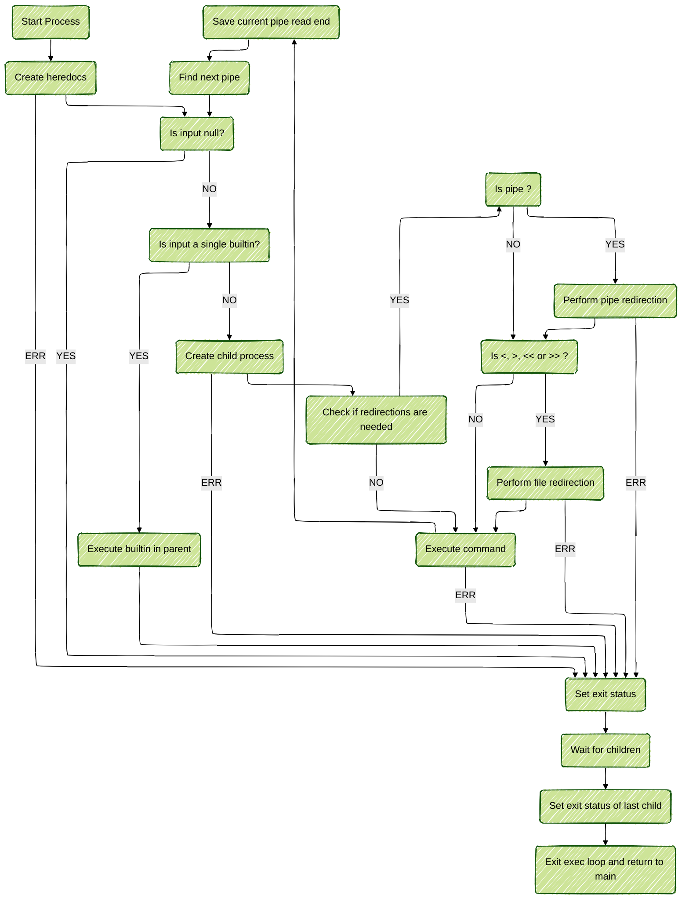

```mermaid
---
config:
  layout: elk
  elk:
    <!-- mergeEdges: true -->
    nodePlacementStrategy: BRANDES_KOEPF
  look: handDrawn
  theme: forest
---
graph TD;
    START(Start Process)
	HDOC(Create heredocs);
    CHECK_INPUT(Is input null?);
	IS_SINGLE_BT(Is input a single builtin?);
    IS_SINGLE_BT_0(Execute builtin in parent);
   	CREATE_CHILD(Create child process);
    NEED_REDIR(Check if redirections are needed)
	SAVE_PIPE("Save current pipe read end");

    NEED_REDIR_pipe_0(Is pipe ?) 
	NEED_REDIR_pipe_1(Perform pipe redirection);
    NEED_REDIR_file_0(Is <, >, << or >> ? )
	NEED_REDIR_file_1(Perform file redirection);
    EXE(Execute command);
    SET_EXIT(Set exit status);

    %% Loop continuation
    CONTINUE(Find next pipe);
    
    %% End of process
    EXIT(Exit exec loop and return to main);
    WAIT(Wait for children)
	SET_LAST_EXIT("Set exit status of last child");

	START --> HDOC
	HDOC -- ERR --> SET_EXIT
	HDOC --> CHECK_INPUT
	CHECK_INPUT -- YES --> SET_EXIT
	CHECK_INPUT -- NO --> IS_SINGLE_BT
	IS_SINGLE_BT -- YES --> IS_SINGLE_BT_0 --> SET_EXIT
	IS_SINGLE_BT -- NO --> CREATE_CHILD
	CREATE_CHILD -- ERR --> SET_EXIT
	CREATE_CHILD --> NEED_REDIR
	NEED_REDIR -- YES --> NEED_REDIR_pipe_0
	NEED_REDIR -- NO --> EXE
	NEED_REDIR_pipe_0 -- YES --> 
	NEED_REDIR_pipe_1 --> NEED_REDIR_file_0
	NEED_REDIR_pipe_1 -- ERR --> SET_EXIT
	NEED_REDIR_pipe_0 -- NO --> NEED_REDIR_file_0
	NEED_REDIR_file_0 -- YES --> 
	NEED_REDIR_file_1 --> EXE
	NEED_REDIR_file_1 -- ERR --> SET_EXIT
	NEED_REDIR_file_0 -- NO --> EXE
	EXE -- ERR --> SET_EXIT
	EXE --> SAVE_PIPE --> CONTINUE --> CHECK_INPUT

	SET_EXIT --> WAIT --> SET_LAST_EXIT --> EXIT
```