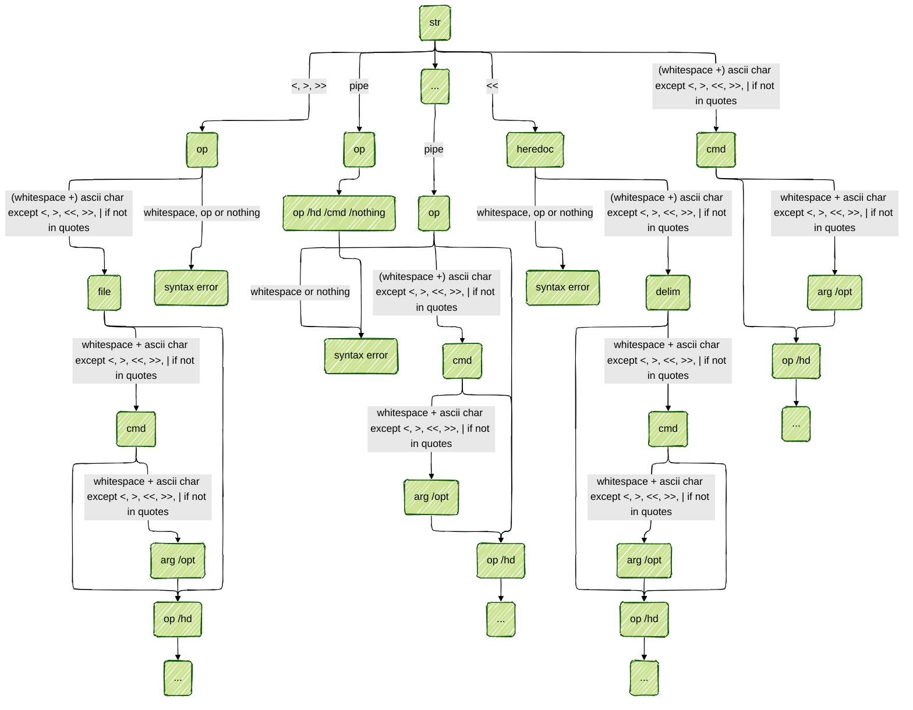

```mermaid
---
config:
  layout: elk
  elk:
    mergeEdges: true
    nodePlacementStrategy: LINEAR_SEGMENTS
  look: handDrawn
  theme: forest
---
graph TD
STR(str) --> |<, >, >>| redir(op) --> |"(whitespace +) ascii char \nexcept <, >, <<, >>, | if not in quotes"| file(file)
redir --> |"whitespace, op or nothing"| redirerror("syntax error")
file --> |"whitespace + ascii char \nexcept <, >, <<, >>, | if not in quotes"| redircmd(cmd)
redircmd --> |"whitespace + ascii char \nexcept <, >, <<, >>, | if not in quotes"| rao(arg /opt)
redircmd --> redirophd
rao --> redirophd
file --> redirophd(op /hd) --> redirdot(...)

STR --> |"pipe"| pip(op) --> A("op /hd /cmd /nothing") --> pipeerror("syntax error")
STR --> dost(...) --> |"pipe"| pipe(op)
pipe --> |"whitespace or nothing"| pipeerror
pipe --> |"(whitespace +) ascii char \nexcept <, >, <<, >>, | if not in quotes"| pipecmd(cmd)
pipe --> op/hd(op /hd)
pipecmd --> |"whitespace + ascii char \nexcept <, >, <<, >>, | if not in quotes"| pao(arg /opt)
pao --> op/hd
pipecmd --> op/hd
op/hd --> dot(...)

STR --> |<<| hd(heredoc)
hd --> |"whitespace, op or nothing"| hderror("syntax error")
hd --> |"(whitespace +) ascii char \nexcept <, >, <<, >>, | if not in quotes"| delim(delim)
delim --> |"whitespace + ascii char \nexcept <, >, <<, >>, | if not in quotes"| hdcmd(cmd) --> |"whitespace + ascii char \nexcept <, >, <<, >>, | if not in quotes"| hdcmdopt(arg /opt)
delim --> hdop(op /hd)
hdcmd --> hdop
hdcmdopt --> hdop
hdop --> hdodt(...)

STR --> |"(whitespace +) ascii char \nexcept <, >, <<, >>, | if not in quotes"| cmd(cmd) 
cmd --> |"whitespace + ascii char \nexcept <, >, <<, >>, | if not in quotes"| cmdopt(arg /opt)
cmd --> cmdop(op /hd)
cmdopt --> cmdop(op /hd)
cmdop --> cmddot(...)
```