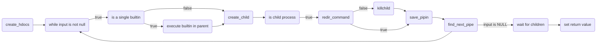
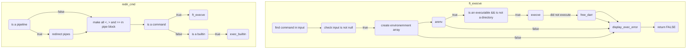

```mermaid
graph LR

	C(create_hdocs)
	C --> D(while input is not null)

	D -->|true| E(is a single builtin)
	E -->|true| F(execute builtin in parent)
	E -->|false| G(create_child)

	F --> G
	G --> H(is child process)
	H -->|true| I(redir_command)
	I --> |false| J(killchild) --> K(save_pipin)
	I --> |true| K
	K--> L(find_next_pipe) --> D

	L --> |input is NULL| CLOSE(wait for children) --> RETURN(set return value)
```

```mermaid
graph
	subgraph ft_execve
		Q2(find command in input)
		Q2 --> R2(check input is not null)
		R2 -->|true| S2(create environemment array)

		S2 --> T2(arenv)
		T2 -->|true| U2(is an executable && is not a directory)
		U2 -->|true| V2(execve)

		V2 --> |did not execute| Y2(free_darr)--> X2(display_exec_error) 

		T2 -->|false| X2
		Y2 --> X2
		S2 -->|false| X2

		X2 --> FALSE(return FALSE)
	 end

	subgraph redir_cmd
		Q1(is a pipeline)
		Q1 -->|true| R1(redirect pipes)
		Q1 -->|false| S1(make all <, > and >> in pipe block)

		R1 --> S1
		S1 --> T1(is a command)
		T1 -->|true| U1(ft_execve)

		T1 -->|false| V1(is a builtin)
		V1 -->|true| W1(exec_builtin)
		U1
	end
```